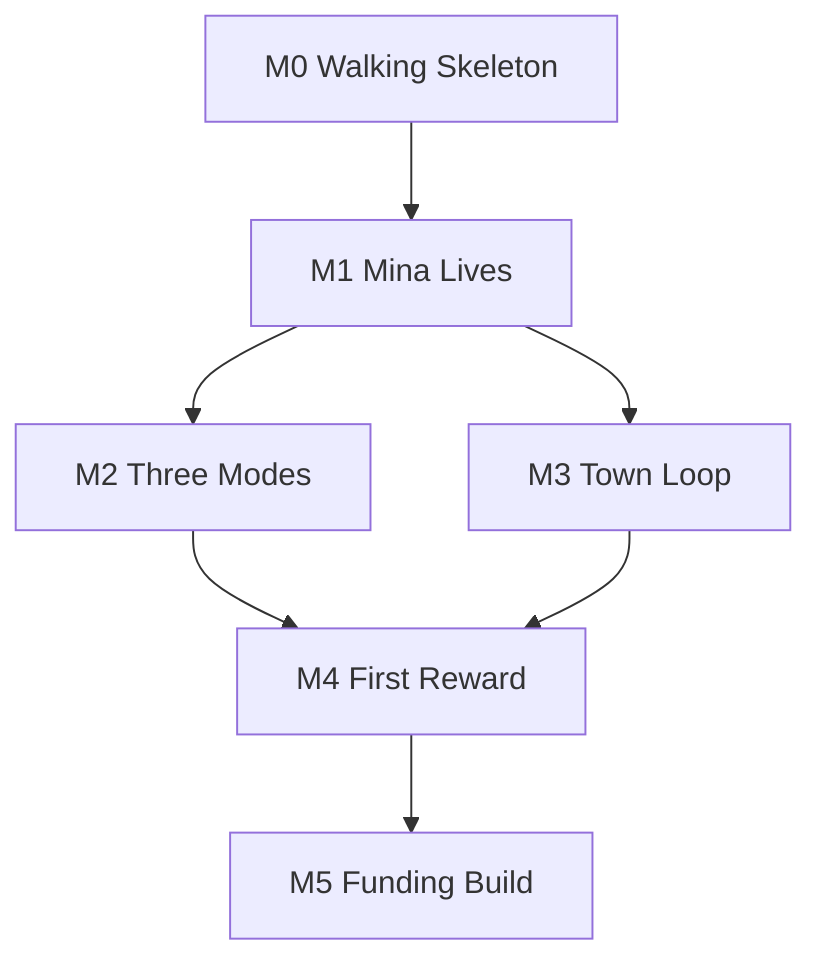

# DeskTown Prototype v0.1 Implementation Plan

## 1. Planning guardrails

- Implement the smallest end-to-end path before production art.
- A Display mode can observe a FocusSession but cannot own or recreate it.
- Simulation changes state; animation only presents state.
- Windows behavior is accepted only on an exported Windows build.
- Replaceable placeholders are preferred until their milestone needs visual
  validation.
- Do not add economy, inventory, AI NPCs, dialogue framework, cloud/account,
  achievements, mobile, macOS, or multiple districts.

## 2. Resolved specification consistency

| Topic | Resolution |
| --- | --- |
| `25 Focus` meaning | 25 elapsed, non-paused minutes in v0.1 |
| Idle vs reward | Idle changes Mina variation and session record only; no penalty |
| Selected apps | Intended-context metadata, not a reward gate |
| Pause | No manual Pause UI; OS suspend/lock uses internal Suspended state |
| Rumi “appears” | Rumi exists ambiently in Town; she steps into the discovery scene, not unlocks as a new NPC |
| Workshop target examples | Progression target 25 is authoritative; `18/50` was illustrative UI copy |
| Ghost engine support | Godot flags first, Windows adapter/verification second, Hidden safety fallback |
| Reward animation/state | State commits before reveal; animation cannot block completion |

No unresolved contradiction blocks M0.

## 3. Milestones

### M0 — Technical Walking Skeleton

**Goal:** launch → start Focus → timer/fake clock → Energy → Workshop progress →
atomic save/load. No art required.

**Exit:** one automated integration scenario restores progress after restart.

### M1 — Mina Lives

**Goal:** activity samples drive Mina logical state and placeholder Idle/Work/
Rest/Stretch presentation in a simple host scene.

**Exit:** state transition tests pass and Mina behaves without reward judgment.

### M2 — Three Display Modes

**Goal:** Companion, Hidden, and Ghost observe the same session; switching loses
no time/progress.

**Exit:** exported Windows Ghost gate passes on a baseline machine and safe
fallback is verified.

### M3 — Town Loop

**Goal:** Main Town, three NPCs, Workshop state presentation, Focus Setup, and
ambient movement work with placeholders.

**Exit:** user can navigate Town → Focus → Town without developer controls.

### M4 — First Reward

**Goal:** Focus completes Workshop, sends passive notification, defers reveal,
plays completion, discovers map, and unlocks Railway teaser across restart.

**Exit:** this is the **Feature Complete Prototype**.

### M5 — Funding Build

**Goal:** replace hypothesis-critical art, add sound/effects/polish, complete
Windows matrix, and produce capture-ready scenes.

**Exit:** no P0/P1 defects, custom Mina/Workshop art, verified demo build.

## 4. Milestone dependency map



M2 and M3 may progress in parallel after M1 interfaces stabilize.

## 5. Critical path

```text
DT-E0-001 → DT-E0-002 → DT-E1-001 → DT-E1-002 → DT-E1-004
→ DT-E2-001 → DT-E8-001 → DT-E8-002 → DT-E3-001
→ DT-E5-001 → DT-E5-002 → DT-E5-003 → DT-E6-001
→ DT-E7-001 → DT-E7-002 → DT-E7-003 → DT-E9-003
```

Ghost proof is deliberately before Town polish: if cross-application input
passthrough is not reliable, the prototype needs an early platform decision.

## 6. Parallel work opportunities

| After | Track A | Track B |
| --- | --- | --- |
| E0 contracts | Focus/activity (E1) | Persistence store (E8) |
| Mina state contract | Companion (E3) | Town scene shell (E6) |
| Display controller | Hidden/Tray (E4) | Ghost platform spike (E5) |
| Town snapshots | Reward logic (E7) | Placeholder environment integration |
| M4 feature complete | Production Mina/Workshop art | Sound/particles and QA automation |

Parallel tasks must not edit the same composition root or save schema without a
short integration checkpoint.

## 7. Asset gates

| Milestone | Required assets |
| --- | --- |
| M0 | none; geometric UI only |
| M1 | placeholder Mina with contract-correct cells |
| M2 | placeholder Mina, work prop, shadow; tray icon |
| M3 | placeholder Town tiles/buildings/NPCs |
| M4 | placeholder Workshop states, map, effects, notification icon |
| M5 | custom Mina 30 frames, Workshop states, core Companion props, map/logo, final audio/effects |

Production asset generation must not block M0–M4 engineering unless the contract
itself proves wrong.

## 8. Technical blockers and kill criteria

1. **Ghost cross-application input passthrough.** Build an exported spike in M2.
   If it intercepts any required input after the isolated native adapter path,
   Ghost remains experimental/disabled and the product decision is escalated;
   do not ship interactive Ghost.
2. **Mixed-DPI multi-monitor placement.** Validate coordinates and scale before
   position persistence is declared done. Off-screen restoration is a blocker.
3. **Session time/save correctness across suspend and crash.** Fake-clock tests
   plus Windows sleep/restart tests must pass before reward content is added.

## 9. Recommended implementation order

The first task is **DT-E0-001 — Pin toolchain and create the Godot C# solution**.
Then complete E0 contracts, Focus domain, and atomic JSON before opening scene
work. The first visible build should be intentionally plain.

## 10. Feature Complete and Funding entry

### Feature Complete Prototype (end of M4)

- Full vertical slice works with placeholders
- Three modes share one session and equal rewards
- Exported Ghost baseline passes or explicitly uses safe-disabled decision
- Activity/privacy, save/restart, pending reveal, and Railway unlock pass
- No P0/P1 defects in core loop

### Funding Build entry

- Feature Complete gate signed off
- Art Gate 1–4 approved (Mina, Work, Workshop, tile cluster)
- Asset catalog is stable; no scene hardcodes vendor filenames
- Performance baseline recorded for Companion/Ghost/Hidden
- Windows test hardware/matrix is available
- Trailer Scene A/B/C can be reproduced from a deterministic demo save

## 11. Out-of-scope checkpoint

At every milestone review, reject backlog additions for economy, currencies,
inventory/crafting, relationship systems, generic dialogue engines, additional
districts/projects, cloud sync, accounts, multiplayer, achievements, mobile, or
macOS. Capture ideas outside the v0.1 backlog without implementing them.

