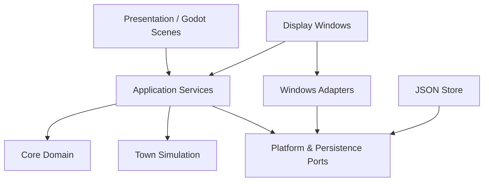
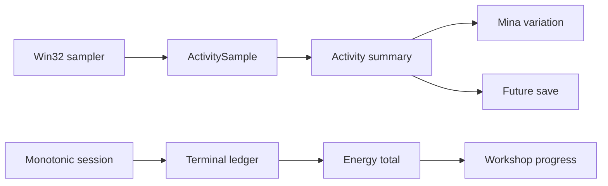

# DeskTown Prototype v0.1 Technical Architecture

## 1. Decision summary

- Engine: Godot 4.7.2 .NET, pinned in `DeskTown.csproj`
- Runtime/toolchain: `net8.0`, .NET SDK 8.0.425, pinned in `global.json`
- Language: C#; pure domain projects avoid `Godot.*` dependencies
- Platform: Windows 11 x64 first
- Process model: one process, one authoritative simulation, multiple native
  Godot `Window` surfaces
- Persistence: versioned, atomic local JSON with one backup
- Tick: 1-second logical tick; rendering at maximum 30 FPS when visible
- Energy policy: elapsed non-paused session time; activity data is descriptive,
  not punitive
- Platform APIs: adapters around Win32; no P/Invoke in domain/presentation code

`.NET 8` was selected because it is the documented baseline for the pinned Godot
line. Its support ends on 2026-11-10, so migration to .NET 10 LTS must be tested
before M2 and adopted if the Godot editor/export pipeline passes unchanged. The
framework change must not be mixed with Ghost native integration work.

## 2. Architecture boundaries



Dependency direction points inward. Core Domain and Simulation do not reference
Godot nodes, Win32 APIs, file paths, or display modes.

## 3. Proposed repository structure

```text
desktown/
├─ DeskTown.sln
├─ project.godot
├─ export_presets.cfg
├─ src/
│  ├─ DeskTown.Domain/
│  │  ├─ Focus/
│  │  ├─ Projects/
│  │  ├─ Simulation/
│  │  └─ Events/
│  ├─ DeskTown.Application/
│  │  ├─ Sessions/
│  │  ├─ Display/
│  │  ├─ Persistence/
│  │  └─ Ports/
│  ├─ DeskTown.Godot/
│  │  ├─ Bootstrap/
│  │  ├─ Presentation/
│  │  ├─ Display/
│  │  └─ Resources/
│  └─ DeskTown.Platform.Windows/
│     ├─ Activity/
│     ├─ Windows/
│     ├─ Tray/
│     └─ Notifications/
├─ scenes/
│  ├─ app/
│  ├─ town/
│  ├─ focus/
│  ├─ companion/
│  ├─ ghost/
│  └─ shared/
├─ assets/
│  ├─ catalogs/
│  ├─ art/
│  ├─ audio/
│  └─ placeholders/
├─ tests/
│  ├─ DeskTown.Domain.Tests/
│  ├─ DeskTown.Application.Tests/
│  └─ DeskTown.Integration.Tests/
└─ docs/
```

This is a target structure, not a scaffold created in the design phase.

## 4. Core domain

### Focus session

The implemented aggregate owns these domain values:

```text
FocusSession
  Id: FocusSessionId
  StartedAtUtc / EndedAtUtc
  TargetDuration
  Status: Ready | Running | Suspended | Completed | Stopped
  CountedDuration / IdleDuration
  IntendedProcessNames
```

Its state-changing methods are `Start`, `Accumulate`, `Suspend`, `Resume`,
`Complete`, and `Stop`. Counted time accumulates only while Running and clamps
at the target; Idle remains descriptive metadata within Counted time.

`FocusSession` contains no `DisplayMode`. Mode-change logs reference the session
from outside the aggregate. `FocusSessionManager` enforces that only one
session may be Running or Suspended; that cross-aggregate rule is not owned by
the session entity.

`FocusSessionManager` responsibilities:

- enforce one active session
- start, tick, suspend, resume, stop, and complete a session
- use a monotonic clock for elapsed time and wall clock for audit timestamps
- publish typed events; never manipulate Windows or Scene nodes directly

The implemented manager removes its monotonic baseline while Suspended and
creates a new one on Resume, so sleep/lock time is excluded even when the clock
source advances. Recovery and checkpoint policy belong to the later lifecycle,
persistence, and coordinator tasks rather than this manager.

### Energy

```csharp
public interface IEnergyPolicy
{
    FocusEnergy CalculateTotal(SessionLedger ledger);
}
```

`ElapsedTimeEnergyPolicy` is v0.1: every counted 60 seconds becomes one displayed
Focus unit. Tick precision is retained internally, so short sessions, early end,
and crash recovery do not accumulate rounding error. A project applies only
`currentTotal.DeltaSince(previouslyAppliedTotal)`, never the cumulative total
again. Idle and process samples do not reduce Energy.

### Simulation

`TownSimulation` consumes counted time and domain events. It operates at 1 Hz or
by elapsed delta after resume; it does not require rendered frames.

- `ProjectSystem`: applies Energy to Restore Workshop, clamps at target, emits
  `ProjectCompleted` as a one-shot result at the completion boundary
- `MinaStateMachine`: derives logical activity from session/activity state
- `EventSystem`: creates pending Workshop reveal and Railway discovery
- `NpcAmbientSystem`: deterministic, low-frequency positions/actions for visible
  Town only; it has no gameplay consequences

## 5. Mina logical and visual state

Logical state and animation clip are separated because transitions such as
returning from Rest require `Walk` presentation before `Work` without changing
the domain's intended activity.

```text
MinaSimulationState
  Activity: Idle | Work | Rest | Celebrate
  Location: Home | Workshop | TownPath
  ProjectId
  ProjectProgress

MinaPresentationState
  Clip: Idle | Walk | Work | Rest | Stretch | Celebrate
  Facing
  PresentationPosition
```

Derivation rules:

| Session/activity | Logical state | Presentation sequence |
| --- | --- | --- |
| No session | Idle | Idle |
| Active input / running | Work | Walk if needed → Work |
| Idle 60–179 s | Work | Stretch once → Idle/Work variation |
| Idle ≥180 s | Rest | Walk if needed → Rest |
| OS/session suspended | Rest | Rest |
| Input returns | Work | Walk → Work |
| Project completed | Celebrate | Work finish → Celebrate |

The 60/180-second thresholds are configuration, not hardcoded in scene scripts.
Idle transitions change only animation variation in v0.1.

## 6. Application services and ports

Key interfaces:

```text
IClock / IMonotonicClock
IActivityTracker
IEnergyPolicy
IFocusSessionStore
IGameStateStore
IDisplayModeController
IWindowPlacementStore
IGhostWindowPlatform
ITrayService
INotificationService
IProcessCatalog
IAssetCatalog
```

Key services:

- `FocusSessionCoordinator`: orchestrates manager, activity tracker, terminal
  ledger, Energy, and checkpoint/finalization seams; E8 owns actual save writes
- `DisplayModeController`: switches surfaces and records debug events
- `RewardRevealCoordinator`: consumes pending presentation without owning state
- `ApplicationLifecycleCoordinator`: startup recovery, single-instance behavior,
  save-on-exit, suspend/resume

Use constructor injection from one composition root. A general-purpose service
locator/event bus is not permitted. Godot signals may bridge Node lifecycle to
typed application events at the presentation boundary.

## 7. Display mode controller

```csharp
public enum DisplayMode { Companion, Hidden, Ghost }

public interface IDisplaySurface
{
    DisplayMode Mode { get; }
    Task ShowAsync(DisplaySnapshot snapshot, CancellationToken ct);
    Task HideAsync(CancellationToken ct);
}
```

Switch algorithm:

1. Validate requested surface capability (especially Ghost).
2. Hide outgoing surface.
3. Show incoming surface from current immutable `DisplaySnapshot`.
4. Save preference and append debug `DisplayModeChanged`.
5. If Ghost validation/show fails, show Hidden and report passive status.

Neither `FocusSessionManager`, `IEnergyPolicy`, nor `ProjectSystem` receives the
selected `DisplayMode`.

## 8. Activity tracking data flow



Sampling at 1 Hz records process name and activity bucket only during an active
session. Raw per-second samples need not persist after aggregation. Never query
or store window title, typed input, URL, screenshot, document/file contents, or
form values.

## 9. Runtime performance

- Visible windows: `Engine.MaxFps = 30`; animation clips retain 2–8 FPS
- Hidden: hide/unload Companion/Ghost stage; no Town rendering; keep 1 Hz logical
  timer and event-driven state changes
- Main Town inactive while focus views are active
- No physics process for domain progression
- Particles have fixed small caps and stop when their surface is hidden
- On resume from sleep, calculate elapsed policy from monotonic/lifecycle data;
  never simulate one frame per missed second

## 10. Failure policy

| Failure | Boundary response |
| --- | --- |
| Tracker API fails | mark unavailable; Timer-only session; no fake sample |
| Process disappears/access denied | aggregate as Unknown, continue |
| Ghost native validation fails | fallback Hidden; preserve session |
| Save write fails | retain in-memory state, retry/notify, never mark checkpoint complete |
| Notification fails | pending reward + Tray tooltip |
| Presentation asset missing | placeholder/final-state view; domain completes |
| Duplicate app launch | focus existing process via single-instance coordinator |

## 11. Architecture constraints for implementation review

- No domain reference to `Godot`, `DisplayMode`, `Window`, `HWND`, or JSON DTOs
- No simulation mutation inside animation callbacks
- No reward calculation inside display surfaces
- No platform API calls outside `DeskTown.Platform.Windows`
- No asset filesystem paths in C# gameplay logic
- No second FocusSession created during mode switching
