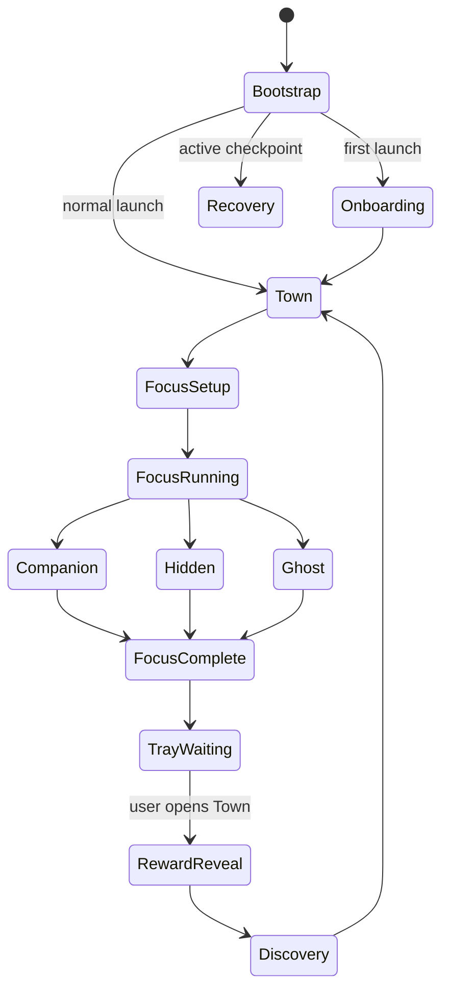

# Godot Scene Structure and Lifecycle

## 1. Root tree

```text
AppRoot (Node) [persistent]
├─ Services (Node)
│  ├─ FocusSessionHost
│  ├─ SimulationHost
│  ├─ PersistenceHost
│  ├─ DisplayModeHost
│  ├─ ActivityTrackerHost
│  └─ PlatformHost
├─ StatusIndicator (StatusIndicator)
├─ MainWindow (Window)
│  └─ MainShell
│     ├─ FirstLaunch
│     ├─ TownScene
│     ├─ FocusSetup
│     ├─ SettingsPanel
│     ├─ RewardReveal
│     └─ DiscoveryEvent
├─ CompanionWindow (Window)
│  └─ CompanionStage
└─ GhostWindow (Window)
   └─ GhostStage
```

`AppRoot` and Services persist for the process lifetime. Presentation children
may be instantiated/unloaded. Subwindows must be native (`embed_subwindows`
disabled) for independent positioning and Windows flags.

## 2. Scene responsibilities

| Scene | Owns | Does not own |
| --- | --- | --- |
| `AppRoot.tscn` | composition root, lifecycle, one app instance | gameplay rules |
| `MainWindow.tscn` | full Town shell and modal layers | focus timing |
| `TownScene.tscn` | map presentation, building/NPC views | project truth |
| `FocusSetup.tscn` | validates user choices, sends start command | creates domain object itself |
| `CompanionWindow.tscn` | native window, drag/scale/position | reward calculation |
| `CompanionStage.tscn` | diorama and Mina visual binding | Mina logical transitions |
| `GhostWindow.tscn` | transparent native host | interaction/UI |
| `GhostStage.tscn` | Mina/prop/effect only | background or controls |
| `RewardReveal.tscn` | camera/effect timeline | logical completion |
| `DiscoveryEvent.tscn` | one-shot event presentation | unlock decision |

## 3. Main Town tree

```text
TownScene (Node2D)
├─ Ground (TileMapLayer)
├─ Paths (TileMapLayer)
├─ Buildings (Node2D)
│  ├─ HouseView
│  ├─ WorkshopView
│  └─ LockedAreaView
├─ Decoration (Node2D)
├─ Characters (Node2D)
│  ├─ MinaView
│  ├─ NoahView
│  └─ RumiView
├─ AmbientFx (Node2D)
├─ Camera2D
└─ TownHud (CanvasLayer)
```

`WorkshopView` binds an enum/state resource to one of three catalog assets. It
does not increment progress. NPC views consume snapshots from simulation.

## 4. Companion stage tree

```text
CompanionStage (Node2D)
├─ Background
├─ WindowProp
├─ LampView
├─ WorkbenchView
├─ StoolView
├─ DecorView
├─ CharacterShadow
├─ MinaView
├─ ToolView
├─ Particles
└─ StatusLayer (CanvasLayer)
   ├─ ProjectLabel
   └─ RemainingTimeLabel
```

The stage has a 360 × 200 logical canvas. Dragging belongs to the window host,
not Mina or props. StatusLayer can be hidden without changing layout.

## 5. Ghost stage tree

```text
GhostStage (Node2D)
├─ CharacterShadow (optional)
├─ WorkProp
├─ MinaView
└─ Particle (optional)
```

No `Control`, focusable node, button, label, or input handler is allowed beneath
GhostStage. The native window remains 240 × 180 and background alpha is zero.

## 6. Lifecycle



During FocusRunning, MainWindow is hidden rather than destroyed. Town processing
and visual nodes are paused. Domain services stay alive.

## 7. Snapshot binding

Presentation receives immutable snapshots:

```text
TownSnapshot
  WorkshopState
  CurrentProject
  ProjectProgress
  NpcStates
  PendingEventIds

CompanionSnapshot
  MinaPresentationState
  ProjectName
  RemainingDuration
  LampState

GhostSnapshot
  MinaPresentationState
  Opacity
```

Views may interpolate position or choose animation, but they cannot mutate the
source snapshot. Reopening a surface requests the newest snapshot.

## 8. Window settings

| Window | Native | Borderless | Topmost | Focusable | Mouse | Background |
| --- | --- | --- | --- | --- | --- | --- |
| Main | Yes | No | No | Yes | Interactive | Opaque |
| Companion | Yes | Yes | Yes | Yes while dragging | Interactive | Opaque diorama |
| Ghost | Yes | Yes | Yes | No | Full passthrough | Transparent |

Companion focus should be released immediately after drag so normal work resumes.
Ghost never gains focus, including during creation/show.

## 9. Asset binding

`AssetCatalogResource` maps stable IDs from the Asset Manifest to Godot resources.
`CharacterAnimator` asks for `character.mina.work`, not a texture path. A
placeholder catalog and production catalog expose identical keys and animation
metadata.

## 10. Scene verification checklist

- Starting any display surface does not instantiate a session
- Hiding all windows leaves AppRoot and logical tick active
- Unloading Companion/Ghost releases particles/audio
- Reopening a surface binds current state, not default animation
- Reward sequence can skip or lose an asset without losing completion
- Ghost scene contains no input/focusable node
- Main Town cannot start a second concurrent session

