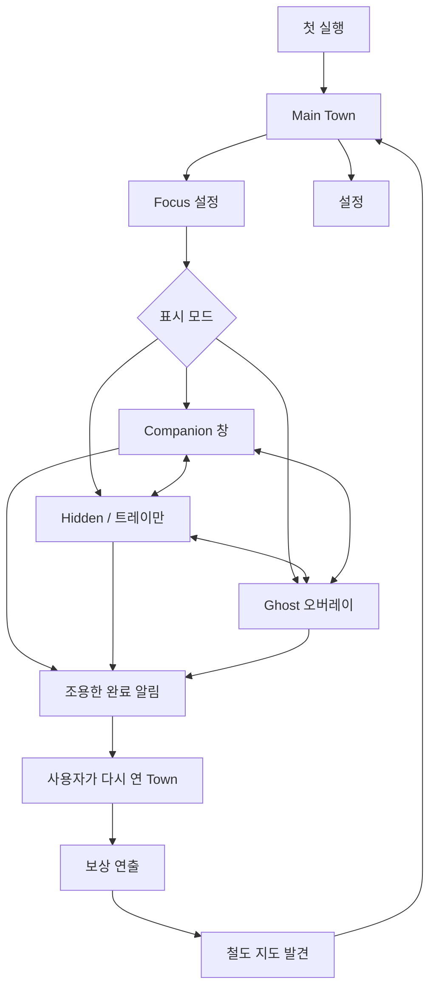
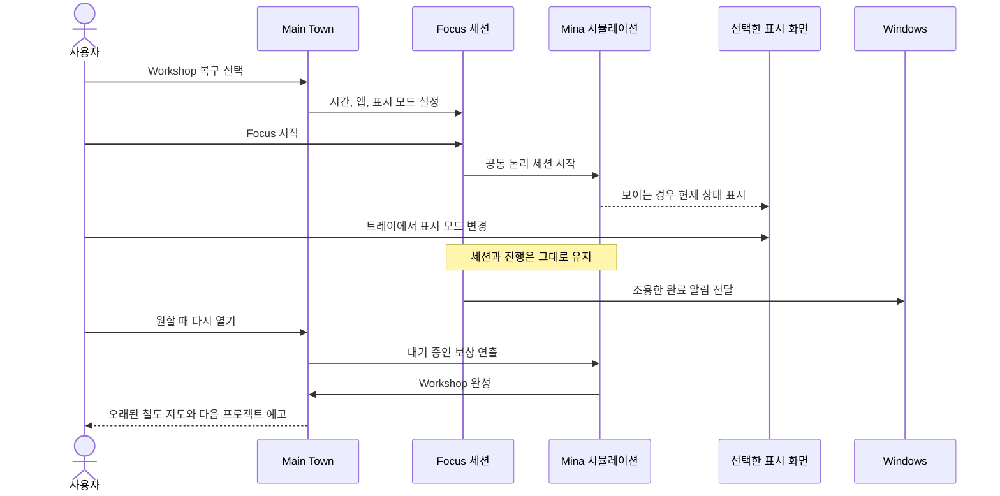
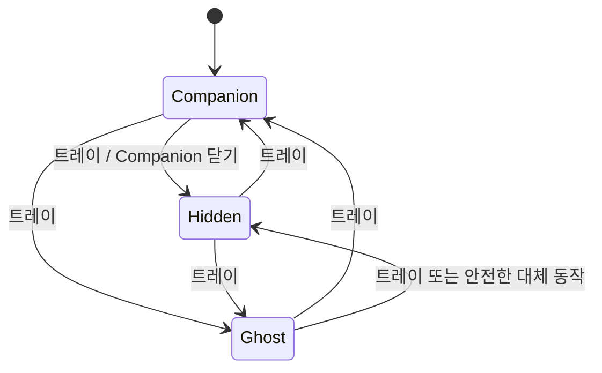

# DeskTown Prototype v0.1 UX 흐름

## 1. 목적과 고정 원칙

검증할 가설은 하나다. 실제 집중 시간이 Mina의 세계에 보이는 변화로 이어지면 사용자가 다음 세션을 시작하고 싶어지는가?

다음 원칙은 변경하지 않는다.

1. 표시 모드는 취향 설정이며 게임 보상을 바꾸지 않는다.
2. Mina는 평가자가 아니라 동료다. v0.1에서 유휴 상태를 탓하거나 경고하거나 보상을 줄이지 않는다.
3. 사용자가 작업하는 동안 완료는 조용히 처리한다. 세션이 끝났다고 Town을 자동으로 열지 않는다.
4. Town은 보상을 보는 곳이다. 집중 화면은 조용하게 유지한다.
5. 프로토타입에는 완성 가능한 프로젝트 한 개와 다음 프로젝트 예고 한 개가 있다.

### v0.1 Focus Energy 규칙

완료한 세션에서 중단되지 않은 1분마다 Focus Energy 1을 얻는다. 전경 프로세스와 유휴 시간은 세션을 이해하기 위해 기록하지만 Energy를 깎지 않는다. 사용자 테스트 후 `IEnergyPolicy`를 교체할 수 있도록 설계한다. 선택한 앱 목록은 사용자가 의도한 작업 맥락과 세션 기록에 사용한다. 감시나 보상 자격 판단 수단이 아니다.

## 2. 화면 지도



온보딩 후 트레이 메뉴는 항상 사용할 수 있다. 표시 모드, 위치, 불투명도, 음향, DeskTown 열기, 세션 종료, 앱 종료를 여기에서 제어한다. Ghost는 현재 일반 Focus에서 비활성화되어 있고 별도 QA 미리보기만 제공한다.

## 3. 전체 경험



## 4. 화면별 명세

### A. 첫 실행

**목적:** 기록을 시작하기 전에 신뢰를 만든다.

**구성**

- 작은 DeskTown 로고와 Mina 그림
- 한 줄 소개: “집중하는 동안 Mina가 작은 마을을 복구해요.”
- 두 열로 된 개인정보 카드
  - Focus 세션 중 기록: 프로세스 이름, 전경 사용 시간, 총 유휴 시간, 세션 시작·종료 시각
  - 기록하지 않음: 입력한 글, 화면 캡처, 파일·문서 내용, 브라우저 URL, 비밀번호·양식, 창 제목
- 로컬 저장 안내: “프로토타입 데이터는 이 PC에만 저장됩니다.”
- 주 동작 `Continue`와 보조 동작 `Quit`

**동작과 전환**

- `Continue`는 `onboardingCompleted=true`를 저장하고 Main Town을 연다.
- 이 화면에서는 활동 기록을 시작하지 않는다. `Start Focus` 이후에만 시작한다.
- 개인정보 안내는 나중에도 설정에서 볼 수 있다.

**빈 상태·오류·중단**

- 로컬 저장 데이터를 만들 수 없다면 Continue 대신 `Retry`와 `Open save folder`를 포함한 간단한 복구 오류를 보여준다.
- 권한을 얻었다고 과장하지 않는다. 현 프로토타입은 일반 Windows 프로세스·유휴 API를 쓰며 문서 내용 접근 권한을 요청하지 않는다.

### B. Main Town

**목적:** 수치보다 세계의 변화를 주된 보상으로 보여준다.

**구성**

- Town 화면: 집, Workshop, 길, 모닥불, 잠긴 Library/지역
- 현재 프로젝트 근처의 Mina와 주변의 Noah·Rumi
- 왼쪽 위의 작은 프로젝트 표시: 이름과 `18 / 25 Focus`
- 오른쪽 위의 조용한 일일 문구: `Completed today 42 min` (현지 종료 날짜 기준)
- 눈에 거슬리지 않는 `Focus` 동작과 설정 아이콘
- 시뮬레이션 상태에 따른 Workshop의 Broken·Repairing·Complete 표시

**동작과 전환**

- Workshop 또는 `Focus`를 선택하면 현재 프로젝트의 Focus 설정을 연다.
- 잠긴 지역은 별도 기능 화면 대신 비모달 “아직 열리지 않았어요” 표시를 보여준다.
- 설정은 Town 위에 패널로 열린다.
- 보상 연출이 대기 중이면 연출 종료 전까지 일반 조작을 기다린다. 처음 2초가 지난 뒤 `Skip`을 선택할 수 있다.

**빈 상태·오류·중단**

- 새 저장 데이터는 Workshop 복구 `0 / 25`에서 시작한다.
- 손상된 원본을 백업에서 복원하면 눈에 거슬리지 않는 안내를 띄운다.
- 활성 세션이 있으면 `Focus in progress`와 `Return to focus`를 보여주고 두 번째 세션을 시작하지 않는다.
- 잠긴 프로젝트의 상세 화면은 없다.

### C. Focus 설정

**목적:** 생산성 대시보드처럼 보이지 않으면서 작업 의도를 설정한다.

**구성**

- 프로젝트 그림·제목, 담당 NPC Mina, 현재 진행
- 25/45/60분 프리셋, 기본 25분
- `Apps for this session`: 현재 실행 중인 프로세스 이름 선택과 간단한 수동 이름 입력
- 같은 비중의 Companion·Hidden·Ghost 표시 카드 세 개
- 카드 공통 설명: “같은 세션, 같은 진행. 원하는 만큼만 DeskTown을 보세요.”
- `Start Focus`

**동작과 전환**

- 시간과 표시 모드는 항상 하나 이상 선택돼 있다.
- 앱 선택은 선택 사항이며 기본은 `Any app`이다.
- 시작 시 Main Town을 숨기고 세션 하나만 만든 뒤 선택한 모드를 적용한다. 표시 모드별 별도 세션을 만들지 않는다.
- Ghost를 처음 사용할 때는 오버레이를 클릭할 수 없으므로 위치·불투명도를 트레이에서 바꾼다는 안내를 한 번 보여준다. 현재 일반 Focus에서는 Ghost가 비활성화되어 있다.

**빈 상태·오류·중단**

- 프로세스 목록을 얻을 수 없으면 `Any app`만 보여주고 설정은 계속 가능하다.
- 활동 어댑터를 사용할 수 없으면 사용자에게 설명한 `Timer-only mode`에서만 시작하고 가짜 프로세스 데이터를 기록하지 않는다.
- v0.1에서는 프로젝트가 없는 상태가 없으며 예외 시 Workshop 복구로 돌아간다.

### D. Companion 창

**목적:** 실시간 성과판이 아니라 작은 동료를 보여준다.

**구성**

- 논리 크기 360 × 200, 75/100/125/150% 프리셋
- 창, 램프, 작업대, 의자, 식물·상자 하나와 Mina가 있는 작은 공간
- 아래쪽 가장자리에만 작은 프로젝트 이름과 조용한 남은 시간
- 진행 막대, 점수, 연속 기록, 활동 등급, 경고 없음

**동작과 전환**

- 테두리 없는 창을 최상단에 표시하며 사용하지 않는 배경 영역에서 드래그할 수 있다.
- 이동 후 위치와 모니터 ID를 저장한다.
- 닫으면 Focus를 끝내지 않고 Hidden으로 바뀐다.
- 트레이에서 Hidden/Ghost로 전환해도 세션을 다시 만들지 않는다. 일반 Focus의 Ghost 전환은 현재 차단돼 있다.
- Mina는 논리 상태에 따라 Active→Work, 짧은 유휴→Stretch/Look, 긴 유휴·중단→Rest, 복귀→Walk→Work를 표시한다.

**빈 상태·오류·중단**

- 스프라이트가 없으면 같은 애니메이션 경계의 안정적인 실루엣 플레이스홀더를 보여준다.
- 활동 기록을 할 수 없으면 입력 활동을 꾸미지 않고 실행·중단 상태만 따른다.
- OS 절전·잠금 중에는 집중 시간이 멈춘다. 복귀 후 활동할 때까지 Mina는 휴식한다.

### E. Ghost 오버레이

**목적:** 상호작용 없이 Mina의 존재감만 보여준다.

**구성**

- 투명한 네이티브 창 240 × 180
- 약 120 × 100에 Mina, 작업 소품, 선택적 그림자·작은 입자 하나 표시
- 불투명도 40%, 기본 65%, 85%
- 글, 타이머, 버튼, 진행 표시, 설정, 입력 영역 없음

**동작과 전환**

- 항상 최상단이고 키보드 포커스를 받지 않으며 마우스 입력이 아래 앱으로 모두 통과해야 한다.
- 위치는 트레이의 모서리 프리셋으로만 바꾼다.
- Alt+Tab·작업 표시줄 제외 여부는 내보낸 Windows 빌드에서 검증한다.
- 입력 통과를 보장하지 못하면 Hidden으로 안전하게 전환하고 트레이로 알린다. 입력 가능한 Ghost를 남겨두지 않는다.
- 현재는 Focus 외부의 QA 미리보기에서만 검사한다.

**빈 상태·오류·중단**

- 소품·효과가 없으면 Mina만 그린다.
- 지원하지 않는 플랫폼 또는 네이티브 창 설정 실패 시 Hidden으로 전환하고 세션은 유지한다.
- 중단·절전 후 복귀한 세션은 상태 문구 없이 Mina의 Rest 동작을 사용한다.

### F. Hidden 모드

**목적:** 동료를 표시하지 않는 선택을 동등하게 제공한다.

**구성:** 창과 오버레이가 없으며 트레이 툴팁에는 `DeskTown • Focus`가 표시된다.

**동작과 전환**

- 시뮬레이션, 활동 기록, Energy, 진행, 저장 체크포인트, 완료 알림은 이어진다.
- Companion과 Ghost 장면을 숨기거나 해제하고 렌더링을 줄인다.
- 트레이에서 보이는 모드로 다시 전환해도 세션을 잃지 않는다.

**빈 상태·오류·중단**

- 트레이 생성에 실패하면 백그라운드에서 실행되고 Windows 알림은 계속 보낸다. 실행 파일을 다시 열면 두 번째 세션 대신 기존 프로세스를 앞으로 가져온다.

### G. 세션 완료 알림

**목적:** 사용자의 작업을 끊지 않고 완료를 알린다.

**구성**

- 제목 `DeskTown`
- 본문 `Mina finished her work. The Workshop has changed.`
- 선택 동작 `Open DeskTown`

**동작과 전환**

- 완료 시 세션을 확정하고 보상 연출을 대기 상태로 저장한다.
- 알림을 닫아도 손해가 없고 Main Town은 닫힌 채로 남는다.
- 알림 또는 트레이의 `Open DeskTown`을 누르면 대기 중인 연출을 연다.

**오류:** 알림 전달에 실패하면 트레이 툴팁만 `DeskTown • Work complete`로 바뀌고 보상은 대기 상태로 남는다.

### H. 보상 연출

**목적:** 쌓인 집중 시간을 기억에 남는 눈에 보이는 결과로 바꾼다.

**순서**

1. 이전 상태의 Town을 연다.
2. 카메라 이동으로 길과 Mina에서 Workshop으로 시선을 이끈다.
3. Mina가 마지막 Work 동작을 두 번 한 뒤 멈춘다.
4. 잠깐 조용히 기다리며 기대감을 만든다.
5. 반짝임, 완료 소리, Workshop 상태 교체, 연기와 창의 불빛을 보여준다.
6. Mina가 기뻐하고 다른 NPC들이 Workshop을 바라볼 수 있다.
7. `Workshop restored` 완료 카드를 표시한다.

**동작과 전환**

- 처음 2초는 건너뛸 수 없고 이후 `Skip`은 같은 최종 상태로 이동한다.
- 재생 전에 완성된 월드 상태를 저장하고 재생 후 연출 소비 표시를 저장한다. 충돌 시 연출은 다시 보일 수 있지만 진행은 취소되지 않는다.

**오류:** 애니메이션이 없으면 Workshop 최종 상태와 완료 카드를 즉시 보여준다. 상태 전이를 애니메이션 콜백에 의존시키지 않는다.

### I. 발견 이벤트

**목적:** 다음 집중 세션을 시작할 구체적인 이유를 제공한다.

**구성**

- `While you were away` 카드: Mina가 Workshop 바닥 아래에서 오래된 철도 지도를 발견
- 오래된 철도 지도 그림
- Rumi의 등장과 “어디로 이어지는 걸까…” 대사
- `New project: Explore the Old Railway — 0 / 45 Focus`
- `Coming in the next build` 표시; 실제로 할 수 없는 프로젝트 내용을 꾸며 보여주지 않음

**동작과 전환**

- `Continue`는 새 프로젝트를 선택·저장한 Town으로 돌아간다.
- 소비된 이벤트 ID를 사용해 저장 데이터당 한 번만 보여준다.

### J. 설정과 트레이

**목적:** Companion 화면을 복잡하게 만들지 않고 창을 제어한다.

**설정 패널**

- 표시 모드, Companion 배율·위치 초기화, Ghost 위치·불투명도, 음향
- 개인정보 요약과 `Open save folder`
- 활성 세션 중 표시 변경은 즉시 적용

**트레이 메뉴의 현재 영문 UI 표기**

```text
DeskTown • Focus
Open DeskTown
Display
  ● Companion
  ○ Hidden
  ○ Ghost
Companion Scale
  75% / 100% / 125% / 150%
Ghost Position
  Top Left / Top Right / Bottom Left / Bottom Right
Ghost Opacity
  40% / 65% / 85%
Audio
End Focus…
Quit…
```

- `End Focus…`는 확인을 받고 완료한 비중단 시간에 대해서만 보상한다.
- Focus 중 `Quit…`은 `Keep running` 또는 `End focus and quit`을 제공하며 세션을 조용히 잃지 않는다.
- v0.1에 수동 Pause는 없다. `Paused`는 OS 절전·잠금과 복구 가능한 활동 기록기·플랫폼 중단에 사용한다.

## 5. 표시 전환 계약



모든 전환에서 다음을 지킨다.

1. 같은 `FocusSessionId`를 유지한다.
2. 이전 창을 숨긴 다음 새 창을 표시한다.
3. Mina의 논리 상태와 프로젝트 진행을 유지한다.
4. 분석·디버깅용 모드 변경 이벤트만 저장한다.
5. 보상을 다시 계산하지 않고 설정을 체크포인트에 저장한다.

현재 Ghost로 향하는 전환은 일반 Focus에서는 비활성화되어 있다.

## 6. 화면 공통 빈 상태·오류·중단 규칙

| 조건 | 사용자 경험 | 게임 결과 |
| --- | --- | --- |
| 저장 데이터 없음 | Workshop 복구 초기 상태 시작 | 불이익 없음 |
| 기본 저장 데이터 손상 | 백업 복구와 조용한 안내 | 마지막 정상 체크포인트 |
| 활동 기록기 사용 불가 | 명시적인 Timer-only 모드 | 동일한 경과 시간 Energy 규칙 |
| 프로세스 목록 비어 있음 | `Any app`만 제공 | 세션 시작 가능 |
| OS 절전·잠금 | 중단 중의 실제 시간을 세지 않음 | 같은 세션 재개 |
| Ghost 플랫폼 검사 실패 | Hidden으로 전환 | 같은 세션·진행 |
| 시각 에셋 없음 | 플레이스홀더 또는 최종 상태 | 시뮬레이션 상태 유지 |
| 알림 실패 | 트레이 완료 표시 | 보상 대기 유지 |
| 세션 중 앱 재시작 | 재개 또는 체크포인트에서 종료 선택 | 세션 중복 없음 |

## 7. 접근성과 어조

- UI 문구에 게으름, 집중 실패, 집중력 상실, 생산성 점수, 처벌을 연상시키는 표현을 쓰지 않는다.
- 색상만으로 정보를 전달하지 않는다. 프로젝트 상태마다 형태·실루엣도 바뀐다.
- 필수 UI는 Windows DPI 100~150%에서 읽을 수 있어야 한다. 픽셀 아트는 정수 배율을 쓰고 글자·UI는 DPI에 맞는 벡터·글꼴 배율을 사용할 수 있다.
- 주변 움직임을 줄일 수 있어야 하며 입자 효과가 없어도 보상 상태 변화를 볼 수 있어야 한다.

## 8. 결정과 검증할 질문

### v0.1에서 확정

- Energy는 키보드·마우스 활동이 아니라 중단되지 않은 세션 경과 시간을 따른다.
- 창 제목과 URL을 수집하지 않는다.
- 수동 Pause 없이 절전·잠금 시 자동 중단한다.
- Companion 닫기는 Hidden 전환이며 Focus 종료가 아니다.
- 보상 연출은 나중에 열고 충돌 후에도 안전하게 복구한다.

### 프로토타입 테스트에서 확인

- Companion의 조용한 남은 시간 문구를 기본으로 보일지, 설정 뒤에 숨길지
- 밝고 어두운 앱 위에서 Ghost 65% 불투명도를 읽을 수 있는지
- 사용자가 앱 선택의 의미를 이해한 뒤에도 `Any app`을 기본값으로 유지할지
- 세션을 일찍 끝냈을 때 Energy를 온전한 분 단위로 버릴지, 초를 내부에 보존하고 표시만 반올림할지
