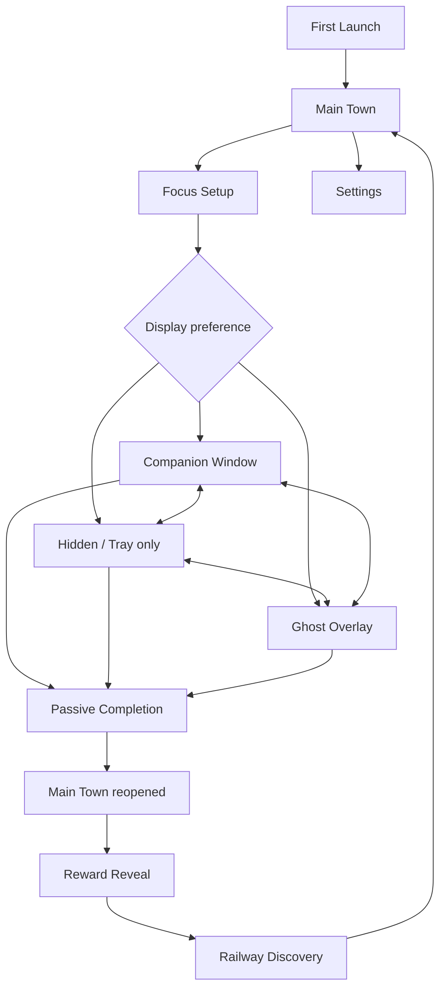
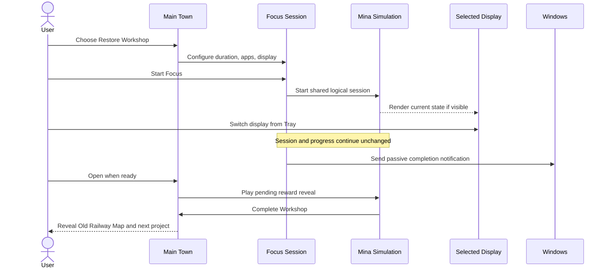
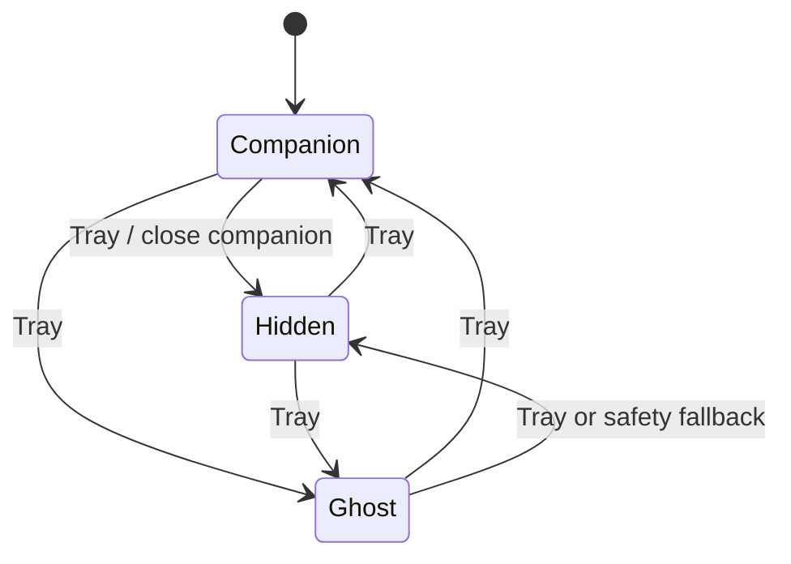

# DeskTown Prototype v0.1 UX Flow

## 1. Purpose and invariants

The UX must test one hypothesis: when real focus time becomes visible change in
Mina's world, does the user want to start another session?

The following rules are non-negotiable:

1. Display mode is a preference, not a gameplay modifier.
2. Mina accompanies rather than judges. Idle never produces blame, warnings, or
   reduced rewards in v0.1.
3. Completion is passive while the user works. DeskTown never opens the Town by
   itself at session end.
4. Town is the reward surface; focus screens remain quiet.
5. The prototype contains one completed project loop and one teaser project.

### v0.1 Focus Energy policy

One completed, non-paused session minute produces one Focus Energy. Foreground
process and idle durations are recorded to understand the session, but do not
penalize Energy. This is deliberately replaceable by an `IEnergyPolicy` after
user testing. The selected-app list labels the intended work context and powers
the session record; it is not surveillance and is not a reward gate.

## 2. Screen map



The Tray menu is globally available after onboarding. It controls display mode,
positions, opacity, audio, opening DeskTown, ending a session, and quitting.

## 3. End-to-end experience



## 4. Screen specifications

### A. First Launch

**Purpose** — establish trust before tracking begins.

**Composition**

- Small DeskTown logo and Mina illustration
- One-sentence product promise: “Your focus helps Mina rebuild a small town.”
- Privacy card with two columns:
  - Records during an active Focus Session: process name, time in foreground,
    total idle duration, session start/end
  - Never records: typed text, screenshots, file/document contents, browser URLs,
    passwords/forms, window titles
- Local-only statement: “Prototype data stays on this PC.”
- `Continue` primary action and `Quit` text action

**Interaction and transition**

- `Continue` stores `onboardingCompleted=true` and opens Main Town.
- Tracking does not start on this screen. It starts only after `Start Focus`.
- Privacy text remains available later from Settings.

**Empty/error/paused**

- If the local save cannot be created, Continue is replaced by a compact
  recoverable error with `Retry` and `Open save folder`.
- No permission claim is made: the current prototype uses ordinary Windows
  process/idle APIs and does not request content access.

### B. Main Town

**Purpose** — make world change, not metrics, the primary reward.

**Composition**

- Town canvas: House, Workshop, path, campfire, locked Library/area
- Mina near the current project; Noah and Rumi in ambient positions
- Quiet top-left project chip: project name and `18 / 25 Focus`
- Quiet top-right daily text: `Today 42 min`
- One unobtrusive `Focus` action and Settings icon
- Workshop visual is Broken, Repairing, or Complete from simulation state

**Interaction and transition**

- Selecting Workshop or `Focus` opens Focus Setup for the current project.
- Selecting Locked Area shows a non-modal “Not yet” label, not a feature page.
- Settings opens the Settings panel over Town.
- If a reward is pending, normal controls wait until Reward Reveal finishes or
  the user selects `Skip` after the initial two-second unskippable beat.

**Empty/error/paused**

- New save: project is Restore Workshop at `0 / 25`.
- Corrupt save recovered from backup: a passive banner explains recovery.
- Active session detected: Town shows `Focus in progress` and `Return to focus`;
  it cannot start a second session.
- Locked project has no detail screen.

### C. Focus Setup

**Purpose** — configure intent without resembling a productivity dashboard.

**Composition**

- Project artwork/title, responsible NPC (Mina), and current progress
- Duration presets: 25, 45, 60 minutes; 25 default
- `Apps for this session`: choose from currently running process names plus a
  compact manual process-name entry
- Three equal display cards: Companion, Hidden, Ghost
- Shared caption beneath all cards: “Same session. Same progress. Choose how
  much of DeskTown you want to see.”
- `Start Focus`

**Interaction and transition**

- At least one duration and one display mode are always selected.
- App selection is optional; `Any app` is the default.
- Start minimizes/hides Main Town, creates one session, and activates the chosen
  display. It never creates a separate session per display.
- Ghost first use shows one preflight notice: position and opacity are changed
  from Tray because the overlay cannot be clicked.

**Empty/error/paused**

- Process enumeration unavailable: app picker shows `Any app` and setup remains
  usable.
- Activity adapter unavailable: Start is allowed only in `Timer-only mode` after
  a plain-language notice; no fake process data is stored.
- No project: impossible in v0.1; fallback returns to Restore Workshop.

### D. Companion Window

**Purpose** — show a tiny coworker, not a live performance dashboard.

**Composition**

- 360 × 200 logical pixels, integer-scaled to 75/100/125/150%
- Diorama: Window, lamp, workbench, stool, one plant/box, Mina
- Bottom edge only: small project label and quiet remaining-time text
- No progress bar, scores, streaks, activity grades, or alerts

**Interaction and transition**

- Borderless window is always on top and draggable from unused background.
- Position and monitor ID persist after drag.
- Close action changes display to Hidden; it does not end Focus.
- Tray changes to Hidden/Ghost without recreating the session.
- Mina reads logical state: Active→Work; short idle→Stretch/Look; long idle or
  paused→Rest; return→Walk→Work.

**Empty/error/paused**

- Missing sprite: stable silhouette placeholder with the same animation bounds.
- Tracking unavailable: Mina follows session running/paused state, not fabricated
  input activity.
- OS sleep/lock: elapsed focus pauses; Mina rests after resume until activity.

### E. Ghost Overlay

**Purpose** — provide Mina's presence with zero interaction.

**Composition**

- Transparent 240 × 180 native window
- Visible content occupies roughly 120 × 100: Mina, work prop, optional shadow
  and one subtle particle
- Opacity preset 40%, 65% default, or 85%
- No text, timer, button, progress, settings, or hit target

**Interaction and transition**

- The window is always on top, cannot take keyboard focus, and is fully mouse
  click-through.
- Position is changed only through Tray corner presets.
- Alt+Tab/taskbar exclusion is validated in the exported Windows build.
- Failure to guarantee click-through triggers safe fallback to Hidden and a Tray
  notification; an interactive Ghost is never left active.

**Empty/error/paused**

- Missing prop/effect: render Mina only.
- On unsupported/native-style failure: Hidden fallback, session unchanged.
- Paused/sleep-resumed session: Mina uses Rest with no status text.

### F. Hidden Mode

**Purpose** — make no visual companion a first-class preference.

**Composition** — no window or overlay. Tray tooltip reads `DeskTown • Focus`.

**Interaction and transition**

- Simulation, tracking, Energy, progress, save checkpoints, and notification
  continue.
- Companion and Ghost scenes are hidden/unloaded; rendering is minimized.
- Tray can switch to either visible mode without session loss.

**Empty/error/paused**

- If Tray creation fails, DeskTown remains in the background and Windows
  notification still fires; reopening the executable focuses the existing
  process instead of creating a second session.

### G. Session Complete Notification

**Purpose** — acknowledge completion without interrupting work.

**Composition**

- Title: `DeskTown`
- Body: `Mina finished her work. The Workshop has changed.`
- Optional action: `Open DeskTown`

**Interaction and transition**

- Notification marks the session complete and stores a pending reward reveal.
- Dismissing it has no penalty. Main Town remains closed.
- `Open DeskTown` or Tray `Open DeskTown` opens the pending reveal.

**Error state** — if notification delivery fails, only the Tray tooltip changes
to `DeskTown • Work complete`; the reward remains pending.

### H. Reward Reveal

**Purpose** — turn accumulated focus into a memorable visible consequence.

**Sequence**

1. Open Town in its previous state.
2. Camera/pan guides the eye from path and Mina to Workshop.
3. Mina performs two final Work beats and stops.
4. A short quiet hold creates anticipation.
5. Spark, completion sound, Workshop state swap, smoke and window light.
6. Mina celebrates; other NPCs may face the Workshop.
7. Completion card appears: `Workshop restored`.

**Interaction and transition**

- First two seconds are unskippable; then `Skip` resolves to the same final state.
- Save the completed world state before playback and the reveal-consumed marker
  after playback. A crash can replay presentation but cannot revoke progress.

**Error state** — missing animation immediately shows the final Workshop state
and completion card. State transition is never coupled to animation callbacks.

### I. Discovery Event

**Purpose** — offer one concrete reason to start the next focus session.

**Composition**

- `While you were away` card: Mina found an old railway map under the floor.
- Old Railway Map art
- Rumi enters or steps forward: “I wonder where this leads…”
- `New project: Explore the Old Railway — 0 / 45 Focus`
- `Coming in the next build` label; no fake playable project content

**Interaction and transition**

- `Continue` returns to Town with the new project selected and saved.
- The event is shown once per save, using a consumed event ID.

### J. Settings / Tray

**Purpose** — control windows without contaminating the companion views.

**Settings panel**

- Display mode, Companion scale/position reset, Ghost position/opacity, audio
- Privacy summary and `Open save folder`
- During an active session, display changes apply immediately

**Tray menu**

```text
DeskTown • Focus
Open DeskTown
Display
  ● Companion
  ○ Hidden
  ○ Ghost
Companion Scale
  75% / 100% / 125% / 150%
Ghost Position
  Top Left / Top Right / Bottom Left / Bottom Right
Ghost Opacity
  40% / 65% / 85%
Audio
End Focus…
Quit…
```

- `End Focus…` asks for confirmation and awards only completed non-paused minutes.
- `Quit…` during Focus offers `Keep running` or `End focus and quit`; no silent
  session loss.
- There is no manual Pause in v0.1. `Paused` is reserved for OS suspend/lock and
  recoverable tracker/platform interruptions.

## 5. Display switching contract



Every transition must:

1. retain the same `FocusSessionId`;
2. hide the outgoing window before showing the incoming window;
3. preserve logical Mina state and project progress;
4. store only an analytics/debug mode-change event;
5. checkpoint settings without recalculating rewards.

## 6. Cross-screen empty, error, and paused policy

| Condition | User experience | Gameplay outcome |
| --- | --- | --- |
| No save | Start clean Restore Workshop state | No penalty |
| Corrupt primary save | Recover backup and show passive banner | Last valid checkpoint |
| Tracker unavailable | Explicit Timer-only mode | Same elapsed-time Energy policy |
| Process list empty | `Any app` only | Session can start |
| OS sleep/lock | Do not count suspended wall time | Resume same session |
| Ghost platform check fails | Fall back to Hidden | Same session/progress |
| Missing visual asset | Placeholder/final state | Simulation remains authoritative |
| Notification fails | Tray completion state | Pending reward retained |
| App restarted mid-session | Recovery prompt: resume or end at checkpoint | Never duplicate session |

## 7. Accessibility and tone

- UI copy never uses lazy, failed focus, lost focus, productivity score, or
  punishment language.
- Information is not color-only; project states have shape/silhouette changes.
- Essential UI is readable at 100–150% Windows DPI. Pixel art uses integer
  content scaling; text/UI can use DPI-aware vector/font scaling.
- Ambient motion can be reduced; reward state changes still appear without
  particle dependency.

## 8. Decisions and open questions

### Decided for v0.1

- Energy is elapsed non-paused session time, not keyboard/mouse activity.
- Window titles and URLs are not collected.
- No manual Pause control; sleep/lock is paused automatically.
- Closing Companion means Hidden, never End Focus.
- Reward reveal is deferred and crash-safe.

### Validate during prototype tests

- Whether the quiet remaining-time text should be visible by default in
  Companion or hidden behind a setting.
- Whether 65% Ghost opacity is readable across light and dark applications.
- Whether `Any app` should remain default after users understand app selection.
- Whether an early-ended session should round Energy down by whole minutes or
  retain seconds internally and only round presentation.

