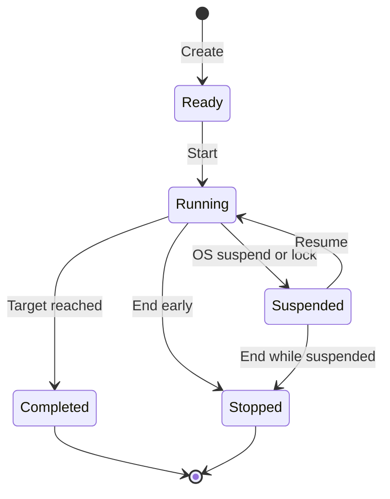

# DT-E1-001 FocusSession Domain Contract

## Scope

This task introduces the display-independent FocusSession aggregate. It does
not add clocks, timers, activity tracking, Energy, persistence, UI, or display
mode behavior; those belong to later E1 tasks.

## State model

All other transitions raise `FocusSessionTransitionException`. There is no
manual Pause gameplay state or UI in v0.1.

## Invariants

- IDs are non-empty GUID value objects.
- start/end audit timestamps use UTC and end cannot precede start.
- target duration is positive.
- counted time accumulates only while Running and clamps at the target.
- idle time is descriptive, is included inside counted time, and never reduces
  counted time or reward eligibility.
- intended process names are trimmed, case-insensitively deduplicated metadata.
- Completed and Stopped are terminal.
- no property, method, or calculation references `DisplayMode`.

`CalculateWallClockElapsed` is audit information and may include suspended wall
time. `CountedDuration` is the authoritative non-suspended progression input.

## Deferred to DT-E1-002+

- monotonic and wall-clock adapters;
- enforcing one active aggregate across the application;
- tick scheduling and OS suspend/resume detection;
- lifecycle events and checkpoints;
- Energy conversion and Project progress.
