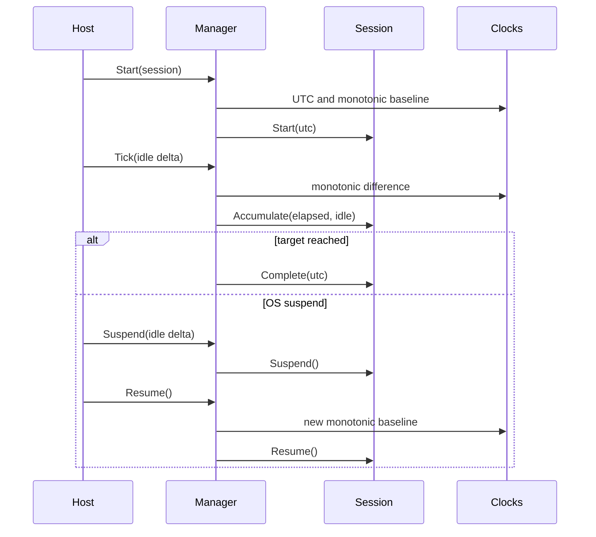

# DT-E1-002 FocusSessionManager Contract

## Scope

`FocusSessionManager` owns the application-level rule that at most one session
may be Running or Suspended. It coordinates time and lifecycle transitions but
does not know about display modes, activity APIs, Energy, projects, rendering,
or persistence.

## Clock semantics

| Clock | Purpose | Rule |
| --- | --- | --- |
| `IMonotonicClock` | Counted focus duration | Differences between Running boundaries only |
| `IWallClock` | UTC audit timestamps and lifecycle events | Must return offset `+00:00` |

Suspend first flushes the Running interval and removes the monotonic baseline.
Resume creates a new baseline. Therefore time passing while the PC is asleep,
locked, or otherwise suspended cannot enter `CountedDuration`, even if the
underlying monotonic source advances during that period.

## Lifecycle

The manager publishes concrete lifecycle records:

- `FocusSessionStarted`
- `FocusSessionSuspended`
- `FocusSessionResumed`
- `FocusSessionCompleted`
- `FocusSessionStopped`

Tick updates are returned as `FocusSessionTickResult`; they are not published as
lifecycle events.

## Safety rules

- starting a second active session fails;
- a backwards monotonic clock fails without applying time;
- a tick crossing the target is clamped and completes exactly once;
- ticks while Suspended are safe no-ops;
- stopping a Running session flushes its final interval;
- stopping a Suspended session adds no time;
- a terminal session allows a new Ready session to start;
- no manager API accepts or returns `DisplayMode`.

## Deferred

- real clock adapters and OS suspend/lock signals;
- Windows activity sampling and idle delta production;
- checkpoint/save orchestration;
- restart recovery;
- Energy conversion and project progress.
